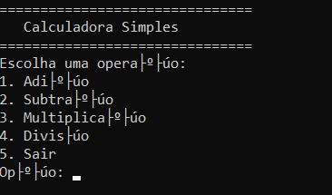

# Simples Calculadora ASCII em C


[](https://opensource.org/licenses/MIT)


Feito com base no exercício [Calculadora Baseada em Texto em C](https://neps.academy/br/project/11), da [Neps Academy](https://neps.academy/).

O software é bem intuitivo: Quando executado, o programa apresenta um menu onde pode-se escolher uma das 4 operações básicas da aritmética (viz. soma, subtração, multiplicação & divisão) ou sair.
Para cada operação, é preciso fornecer 2 números e todo o cálculo e feito com números duplamente precisos de ponto flutuante (i.e. `double`s).



## Instalação

Para usar este projeto, é necessário compilar a script em `main.c`.
Assim, é necessário ter um compilador de C instalado.
Para as instruções a seguir, o GCC 8.1.0 será usado.

O GCC pode ser instalado com os seguintes comandos em Linux ou com o [MinGW](https://sourceforge.net/projects/mingw/) para Windows.

```bash
# Para Debian/Ubuntu, com o `apt`:
sudo apt-get update
sudo apt-get install gcc

# Para Arch Linux:
sudo pacman -S gcc
```

Confira a instalação do GCC com o comando `gcc --version`.

É possível compilar a script do projeto com o GCC por meio do comando a seguir. É possível mudar o nome do executável gerado com o parâmetro `-o`. Substitua `<diretório do projeto>` com o caminho apropriado no qual `main.c` se encontra.

```bash
gcc <diretório do projeto>/main.c -o 'Simples Calculadora.exe'
```

Para usar o software, agora só é preciso executar o arquivo gerado no terminal.

## Uso

Uma vez usando o software, é preciso se atentar ao que é pedido em cada campo.

O programa começa pedindo para que uma opção do menu seja escolhida.
É necessário digitar o número da opção escolhida e pressionar Enter.
Caso a opção escolhida seja uma operação aritmética, o programa pede o primeiro e segundo números, um de cada vez, a serem operados.
Assim, é possível prover qualquer número, decimal ou não que não supere o limite numérico de 
64b.

Com o resultado obtido, o programa pergunta se deseja fazer uma nova operação.
É necessário responder com um único caractere: `s` para voltar ao menu e fazer uma nova operação ou `n` para sair do programa e voltar ao terminal.

# Estrutura

Este projeto é muito simples. Há somente um arquivo de script e alguns arquivos adicionais para o GitHub.
Confira:
  
  ```
  exercise--calculadora-ascii-em-c/  
  │── .gitignore
  │── LICENSE
  │── main.c
  │── README.md
  └── assets/  
      └── print.png  
  ```
